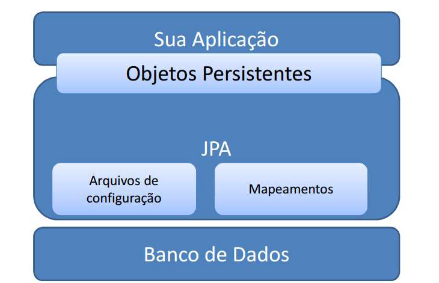

# Java Persistence API (JPA)

O **Java Persistence API (JPA)** é a especificação padrão da plataforma Java EE (pacote `jakarta.persistence`) para mapeamento objeto-relacional e persistência de dados. JPA é definido pela **JSR 338**. Para trabalhar com JPA, você precisa incluir uma implementação da API, como o **Hibernate**.
[JavaPersistence.pdf](http://download.oracle.com/otn-pub/jcp/persistence-2_1-fr-eval-spec/JavaPersistence.pdf)

**Aplicação**

- 

## Principais Classes

1. **EntityManager**:
    [EntityManager](http://download.oracle.com/otn-pub/jcp/persistence-2_1-fr-eval-spec/JavaPersistence.pdf)
   - Encapsula uma conexão com o banco de dados.
   - Realiza operações de acesso a dados (inserção, remoção, atualização, deleção) em entidades (clientes, produtos, pedidos etc.) monitoradas no mesmo contexto de persistência.
   - Escopo: Normalmente, mantém-se uma instância única de `EntityManager` por thread do sistema (em aplicações web, uma por requisição).

2. **EntityManagerFactory**:
    [EntityManagerFactory](https://docs.oracle.com/javaee/7/api/javax/persistence/EntityManagerFactory.html)
   - Utilizado para instanciar objetos `EntityManager`.
   - Escopo: Normalmente, mantém-se uma instância única de `EntityManagerFactory` para toda a aplicação.

